# Fueling the Future: A Data-Driven Look at Historical Gasoline Demand in Ontario

**Author:** Dylan Bui | **Date:** June 6, 2025

**Skills demonstrated:** Time series analysis · SARIMA modeling · Box-Cox transformation · Maximum likelihood estimation · Model diagnostics (Shapiro-Wilk, Box-Pierce, Ljung-Box, McLeod-Li) · Forecasting · R (`forecast`, `tsdl`, `stats`)

📄 [View the R Markdown source](./Forecasting-Ontario-Gasoline-Demand.Rmd)

---

## Table of Contents
- [Abstract](#abstract)
- [Introduction](#introduction)
- [1. Import Data and Train-Test Split](#1-import-data-and-train-test-split)
- [2. Exploratory Analysis & Variance Stabilization](#2-exploratory-analysis--variance-stabilization)
- [3. Removing Trend and Seasonality](#3-removing-trend-and-seasonality)
- [4. Model Identification and Selection](#4-model-identification-and-selection)
- [5. Diagnostic Checking](#5-diagnostic-checking)
- [6. Forecasting](#6-forecasting)
- [Conclusion](#conclusion)
- [References](#references)
- [Appendix: Full Code](#appendix-full-code)

---

## Abstract

This project investigates the forecasting of monthly gasoline demand in Ontario, Canada, using historical data from January 1960 to December 1975. The primary objective is to construct a predictive model using the first 186 months of data (January 1960 – June 1975), and evaluate its forecasting performance over the final 6 months (July – December 1975).

To achieve this, a Box-Cox log transformation and differencing at lags 1 and 12 were applied to stabilize variance and remove the trend and seasonality. Various SARIMA models were then fitted, and the best model was selected by filtering through each of their AICc values, followed by diagnostic checking to confirm residual normality and white noise behavior. The final chosen model, **SARIMA(2, 1, 0)(0, 1, 1)[12]**, produced forecast intervals that successfully captured the true observed values, with the exception of one outlier. The forecasting results illustrate the model's effectiveness in capturing both seasonal and auto-regressive structure in gasoline demand, supporting SARIMA as a reliable method for short-term forecasting.

## Introduction

The dataset used in this project is titled "Monthly Gasoline Demand Ontario (gallon millions)," and was extracted from R's Time Series Data Library (`tsdl`). The data is recorded monthly, spanning from January 1960 to December 1975, and measures the amount of gasoline consumed or sold in Ontario, Canada, in millions of gallons. My motivation for selecting this dataset was to observe how consumers and industries responded to economic cycles and price shocks, while also analyzing the seasonal patterns commonly associated with gasoline demand — patterns that may generalize to other regions.

The goals of this project are to capture any long-term trends and fluctuations between January 1960 and June 1975, fit a time series forecasting model using this training period, and generate a short-term forecast for the final six months, from July to December 1975. To prepare the data, a Box-Cox log transformation was applied to achieve a stationary variance, followed by differencing at lags 1 and 12 to remove the trend and seasonal components. A suitable ARMA model was generated by using maximum likelihood estimation, which implemented a for loop and compared models based on their AICc, however the model was too complex to use in analysis. Numerous SARIMA models, derived from the ACF and PACF of the transformed data, were then considered and evaluated. The best model, model 5, was selected based on its low AICc value, stationarity, invertibility, and its performance on statistical diagnostic tests, including the Shapiro-Wilk, Box-Pierce, Ljung-Box, and McLeod-Li tests — all of which confirmed that the residuals resemble white noise.

While the AR(0) condition was not met, suggesting minor autocorrelation, this was acknowledged and investigated through multiple model refinements, which did not meaningfully reduce the autocorrelation. Furthermore, the residual ACF and PACF plots consistently showed spikes at lag 23, which persisted despite adjustments to the seasonal structure. Since these spikes did not appear to be seasonally related or significantly affect the residual diagnostics, they were concluded to be non-problematic, and model 5 was retained for forecasting.

The final selected model, SARIMA(2, 1, 0)(0, 1, 1)[12], generated forecasts whose confidence intervals captured five of the six actual observed values in the test set, with one point falling slightly outside. While not all observed values were contained within the confidence bounds, the model still demonstrated reasonable and consistent forecasting performance.

All analysis was conducted in R, utilizing packages such as `forecast`, `tsdl`, and `stats`. The dataset was obtained from the Time Series Data Library, a publicly available resource in R.

---

## 1. Import Data and Train-Test Split

```r
library(tsdl)
gas <- subset(tsdl, 12, "Sales")[[1]]
attr(gas, "description")
```
```
## [1] "Monthly gasoline demand Ontario gallon millions 1960 – 1975"
```

```r
train_gas <- gas[c(1:186)]
test_gas <- gas[c(187:192)]
```

Training set: January 1960 – June 1975 (186 months). Test set: July – December 1975 (6 months).

---

## 2. Exploratory Analysis & Variance Stabilization

### Plot Time Series of Training Data

```r
plot.ts(as.numeric(train_gas),
        main = "Original Time Series of Training Data",
        ylab = "Gas Demand")
ntr = length(as.numeric(train_gas))
fit_train <- lm(as.numeric(train_gas) ~ as.numeric(1:ntr))
abline(fit_train, col = "red")
abline(h = mean(as.numeric(train_gas)), col = "blue")
```

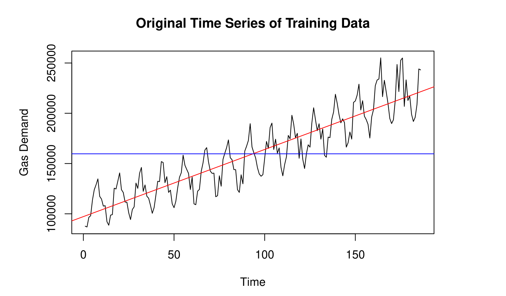

From the original time series plot, it is evident that the variance of the data increases as time increases, so we will first transform the data and stabilize the variance by applying a Box-Cox log transformation.

### Stabilize Variance with Box-Cox Log Transformation

```r
gas.log = log(train_gas)

par(mfrow = c(1,2))
hist(train_gas, col = "purple", xlab = "", main = "Histogram of Training Data")
hist(gas.log, col = "blue", xlab = "", main = "Histogram of Log(Gas) Data", breaks = 10)
```

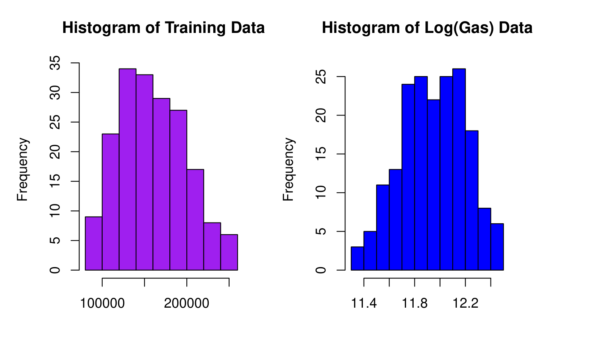

By comparing the histogram before and after the log Box-Cox log transformation, the histogram of the log-transformed data appears more Gaussian. Therefore, we will use the log-transformed data in the following analysis.

```r
gas.log_raw = as.numeric(gas.log)
plot.ts(gas.log_raw, main = "Log(Gas) Demand", ylab = "Log(Gas)")
nt = length(gas.log_raw)
fit <- lm(gas.log_raw ~ as.numeric(1:nt))
abline(fit, col = "red")
abline(h = mean(gas.log_raw), col = "blue")
```

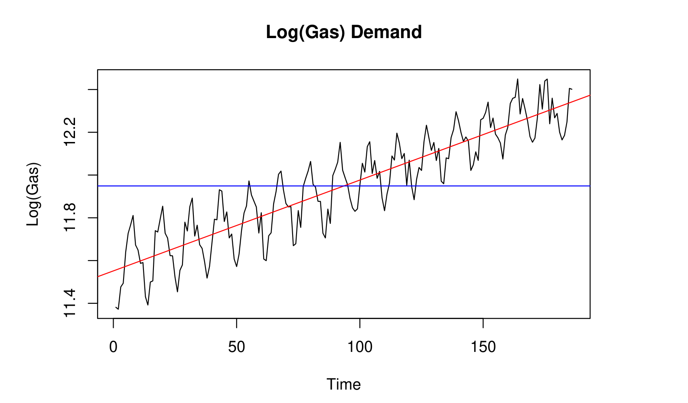

The variance appears more stable as time passed, but the positive trend and seasonality is still clearly present in the data. Before assessing whether or not applying the log-transformation to the time series is effective, I am going to remove the trend and seasonal components.

### ACF and PACF of Log-Transformed Data

```r
acf(gas.log, lag.max = 40, main = "")
title("ACF of Log(Gas)")
```

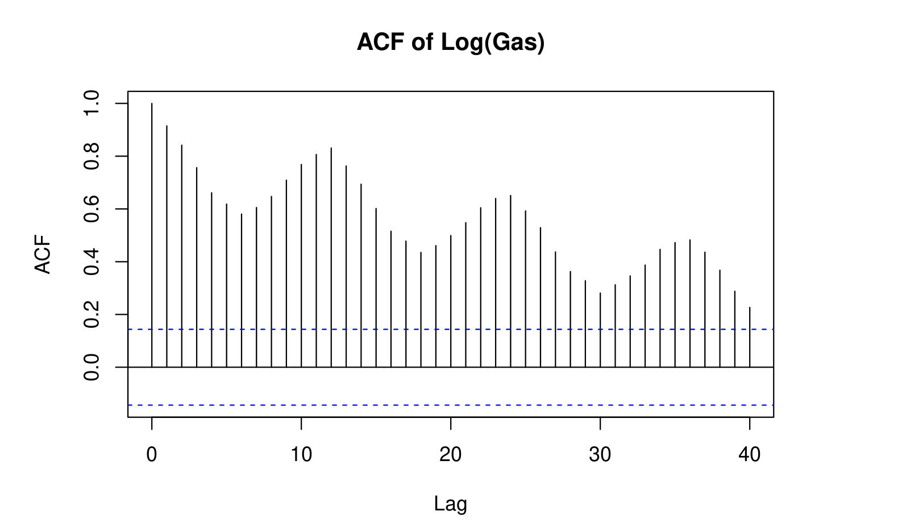

```r
pacf(gas.log, lag.max = 40, main = "")
title("PACF of Log(Gas)")
```

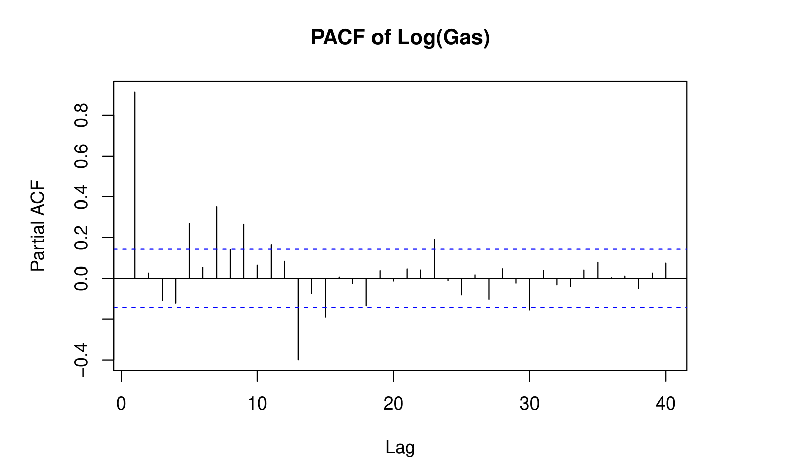

There appears to be both trend and seasonality still present, with the ACF decaying slowly with time, while also having a period every 12 lags. We will first deal with the trend, which can be removed by differencing at lag 1.

---

## 3. Removing Trend and Seasonality

### Removing Trend Component (Differencing at Lag 1)

```r
gas.lag_1 <- diff(gas.log, lag = 1)
plot.ts(gas.lag_1, main = "Log(Gas), Differenced at Lag 1", ylab = "Log(Gas)")
fit_1 <- lm(gas.lag_1 ~ as.numeric(1:length(gas.lag_1)))
abline(fit_1, col = "red")
abline(h = mean(gas.lag_1), col = "blue")
```

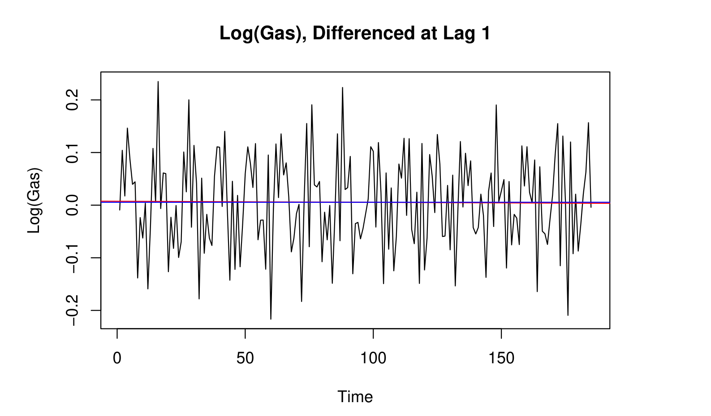

After taking difference at lag 1 on the log-transformed data, the trend disappears with mean almost equal to zero — the red regression fit line (trend) closely lines up with the blue horizontal line (constant mean). Differencing at lag 1 eliminates the trend, however, seasonality is still present.

```r
var_log <- var(gas.log)      # 0.0646538
var_diff_1 <- var(gas.lag_1) # 0.008146
```

The variance also decreases from 0.0646538 to 0.008146, confirming differencing at lag 1 was both effective in removing the trend and reducing variance.

```r
acf(gas.lag_1, lag.max = 40, main = "")
title("ACF of Log(Gas), Differenced at Lag 1")
```

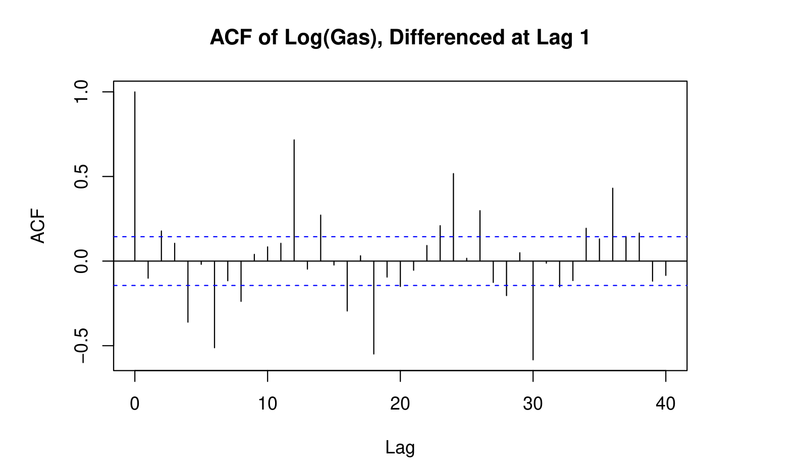

The ACF still illustrates seasonality, which needs to be dealt with before a fitted model can be chosen for forecasting.

### Removing Seasonal Component (Differencing at Lag 12)

```r
gas.lag_1_12 <- diff(gas.lag_1, lag = 12)
plot.ts(gas.lag_1_12, main = "Log(Gas), Differenced at Lag 1 and 12", ylab = "Log(Gas)")
fit_1_12 <- lm(gas.lag_1_12 ~ as.numeric(1:length(gas.lag_1_12)))
abline(fit_1_12, col = "red")
abline(h = mean(gas.lag_1_12), col = "blue")
```

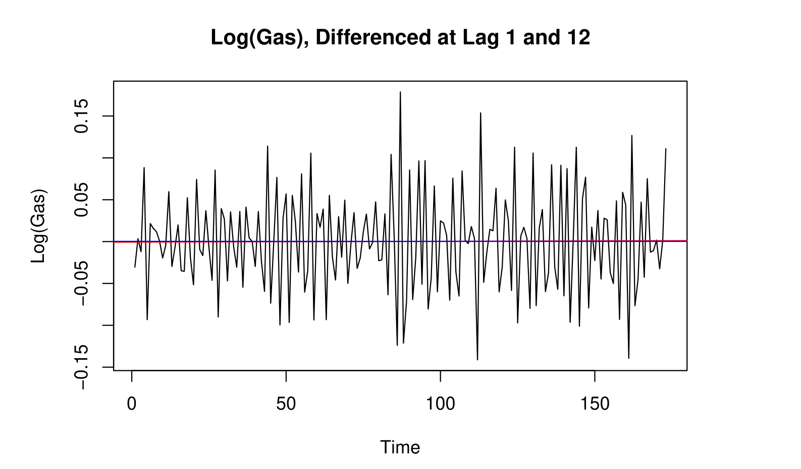

The seasonality has been eliminated with no periods, and the variance is stable over time (with some peaks likely attributable to random noise from real-world events).

```r
var_diff_1 <- var(gas.lag_1)   # 0.008146
var_diff_12 <- var(gas.lag_1_12) # 0.0036952
```

Differencing at lag 12 was also appropriate, again significantly reducing the variance.

```r
acf(gas.lag_1_12, lag.max = 60, main = "")
title("ACF of Log(Gas), Differenced at Lag 1 and 12")
```

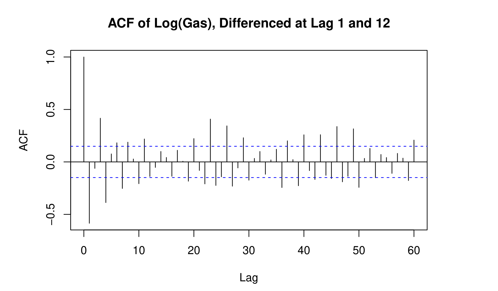

```r
pacf(gas.lag_1_12, lag.max = 60, main = "")
title("PACF of Log(Gas), Differenced at Lag 1 and 12")
```

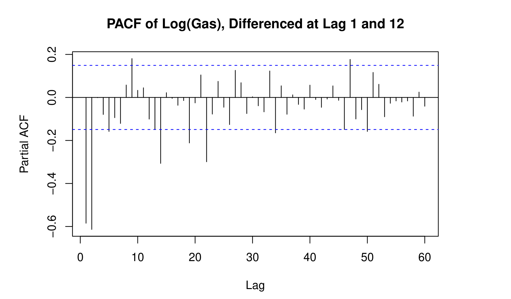

**Selecting coefficients for the potential fitted model:**
- **(p):** ACF decays slowly; PACF shows significant negative spikes at lag 1 and 2 → p = 1 or 2
- **(q):** ACF gradually decreases after lag 1, suggesting little MA structure → q = 0 or 1
- **(P):** PACF not significant at lag 12 or 24, suggesting no seasonal AR term → P = 0
- **(Q):** ACF has small significant negative spikes at lag 24 and 36 (Q = 3), but fewer coefficients are preferable → Q = 2 or 3

---

## 4. Model Identification and Selection

### Custom AICc Function & Grid Search

Since I could not access the `AICc()` function from the `qpcR` library, I defined an equivalent function manually and used it for maximum likelihood estimation. The grid search's best result was ARMA(5,5), which — with 10 coefficients — was too complex to be a practical candidate, so it was excluded.

```r
AICc <- function(model) {
  loglik <- as.numeric(logLik(model))
  k <- attr(logLik(model), "df")
  n <- length(residuals(model))
  aic <- -2 * loglik + 2 * k
  aicc <- aic + (2 * k * (k + 1)) / (n - k - 1)
  return(aicc)
}

aiccs <- matrix(NA, nr = 6, nc = 6)
dimnames(aiccs) = list(p = 0:5, q = 0:5)
for(p in 0:5) {
  for(q in 0:5) {
    aiccs[p + 1, q + 1] = AICc(arima(gas.log, order = c(p, 1, q), method = "ML"))
  }
}
```

### Candidate SARIMA Models

Four candidate models were fit and refined based on significance of coefficients (95% confidence intervals: estimate ± 2·SE):

| Model | Order | Seasonal Order | AICc |
|---|---|---|---|
| Model 1 | (1,1,0) | (0,1,3)[12] | -589.97 |
| Model 2 | (1,1,0) | (0,1,2)[12] | -591.86 |
| Model 3 | (1,1,1) | (0,1,2)[12] | -643.79 |
| Model 4 | (2,1,1) | (0,1,2)[12] | -669.73 |
| **Model 5** | **(2,1,0)** | **(0,1,1)[12]** | **-672.42** |

Model 5 was derived from Model 4 by dropping the `ma1` and `sma2` coefficients, whose confidence intervals contained zero (i.e., were not statistically significant).

```r
model5 <- arima(gas.log, order = c(2, 1, 0),
                 seasonal = list(order = c(0, 1, 1), period = 12),
                 method = "ML")
model5
```
```
## Coefficients:
##          ar1      ar2     sma1
##      -0.9827  -0.6875  -0.5870
## s.e.  0.0553   0.0549   0.0726
##
## sigma^2 estimated as 0.001102: log likelihood = 340.32, aic = -672.64
```

Model 5 had the lowest AICc value with the fewest coefficients, making it the most ideal candidate for the best fitted model.

### Stationarity & Invertibility

**Model formula:** (1 + 0.9827B + 0.6875B²)(1 − B)(1 − B¹²)Xₜ = (1 − 0.5870B¹²)Zₜ, where Xₜ = log(Uₜ), and Uₜ is the original data.

```r
polyroot(c(1, 0.9827, 0.6875))
```
```
## [1] -0.7146909+0.9714743i -0.7146909-0.9714743i
```

- **AR part:** Roots have modulus |1.2060| > 1 → the model is **stationary**.
- **SMA part:** |−0.5870| < 1 → the model is **invertible**.

---

## 5. Diagnostic Checking

```r
res5 = residuals(model5)
par(mfrow = c(2,2))
hist(res5, density = 20, breaks = 20, col = "blue", xlab = "", prob = TRUE,
     main = "Histogram of Residuals of Model 5")
curve(dnorm(x, mean(res5), sqrt(var(res5))), add = TRUE)
plot.ts(res5, ylab = "Residuals of Model 5", main = "Residuals Plot of Model 5")
abline(lm(res5 ~ as.numeric(1:length(res5))), col = "red")
abline(h = mean(res5), col = "blue")
qqnorm(res5, main = "Normal Q-Q Plot for Model 5")
qqline(res5, col = "blue")
```

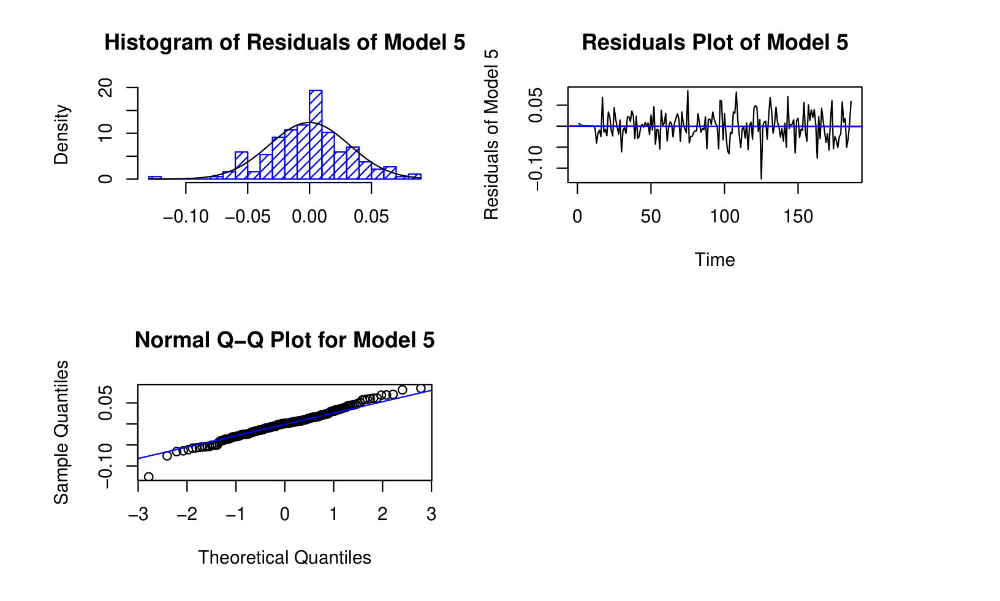

Based on the histogram and normal Q-Q plot for model 5, the residuals do appear normal. In the time series plot of the residuals, there is no trend or obvious seasonality.

### Portmanteau Statistics

```r
shapiro.test(res5)
Box.test(res5, type = "Box-Pierce", lag = 13, fitdf = 3)
Box.test(res5, type = "Ljung-Box", lag = 13, fitdf = 3)
Box.test((res5)^2, type = "Ljung-Box", lag = 13, fitdf = 0)
```

| Test | Statistic | p-value |
|---|---|---|
| Shapiro-Wilk | W = 0.98892 | 0.1569 |
| Box-Pierce | X² = 15.281 (df=10) | 0.1222 |
| Ljung-Box | X² = 15.981 (df=10) | 0.1002 |
| McLeod-Li | X² = 9.834 (df=13) | 0.7074 |

*(lag = 13 since n = 186 observations, √186 ≈ 13; fitdf = 3 for model 5's three estimated coefficients)*

All p-values exceed 0.05, so Model 5 passes every Portmanteau test.

### AR(0) Check and Residual ACF/PACF

```r
ar(res5, aic = TRUE, order.max = NULL, method = "yule-walker")
```

The residuals do **not** select order 0, indicating some minor autocorrelation is still present.

```r
acf(res5, lag.max = 40, main = "")
title("ACF of the Residuals of Model 5")
```

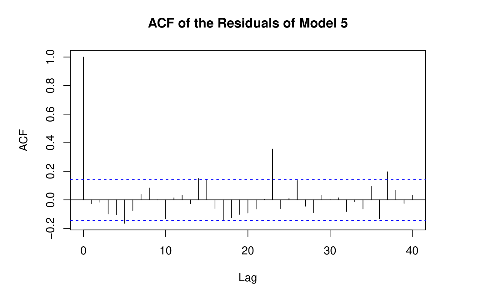

```r
pacf(res5, lag.max = 40, main = "")
title("PACF of the Residuals of Model 5")
```

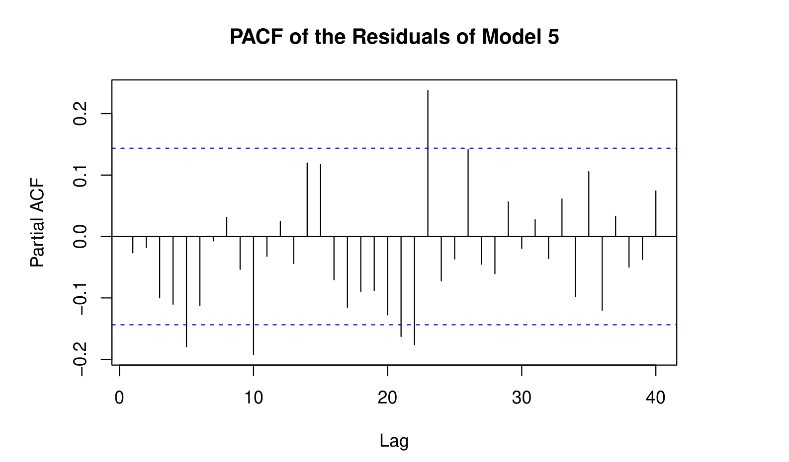

Both plots show a persistent spike at lag 23. I tested alternate seasonal terms (P, Q) to try to resolve it, but the spike never disappeared. Since it does not appear seasonally related and the rest of the spikes are borderline/isolated (likely random noise), it was concluded to be non-problematic. Model 5, **SARIMA(2, 1, 0)(0, 1, 1)[12]**, was retained as the best fitted model — it is simpler, stationary, invertible, passed all Portmanteau tests, and had the lowest AICc, despite not meeting the strict AR(0) condition.

---

## 6. Forecasting

```r
bestmodel <- arima(gas.log, order = c(2, 1, 0),
                    seasonal = list(order = c(0, 1, 1), period = 12),
                    method = "ML")

library(forecast)
pred.log <- predict(bestmodel, n.ahead = 6)
U.tr = pred.log$pred + 2 * pred.log$se
L.tr = pred.log$pred - 2 * pred.log$se

ts.plot(gas.log, xlim = c(1, length(gas.log) + 6), ylim = c(min(gas.log), max(U.tr)))
lines(U.tr, col = "blue", lty = "dashed")
lines(L.tr, col = "blue", lty = "dashed")
points((length(gas.log)+1):(length(gas.log)+6), pred.log$pred, col = "black", pch = 16)
```

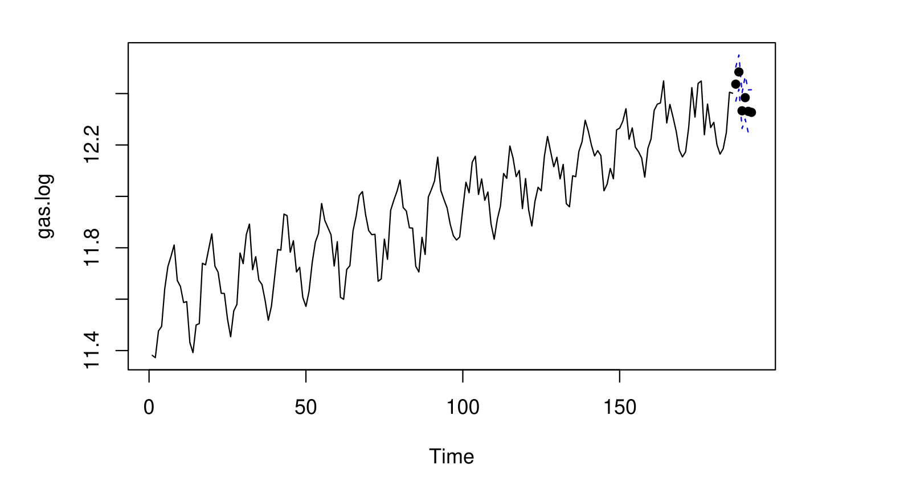
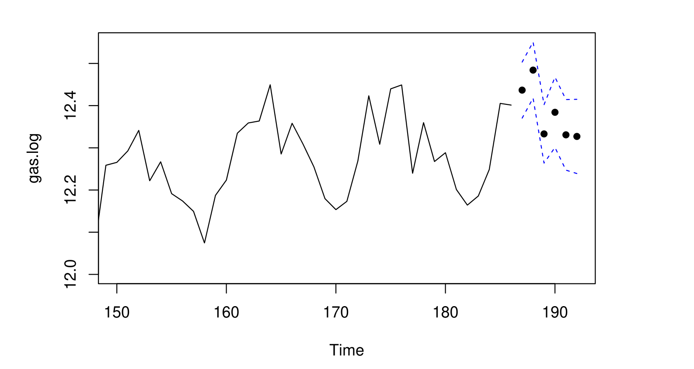

In the forecast plot on the log-transformed data, the six-step-ahead forecasted values fall within the calculated confidence intervals.

### Fit on the Test Set (Original Scale)

```r
pred.orig <- exp(pred.log$pred)
U <- exp(pred.log$pred + 2 * pred.log$se)
L <- exp(pred.log$pred - 2 * pred.log$se)
index <- (length(train_gas) + 1):(length(train_gas) + length(test_gas))

ts.plot(as.numeric(gas), ylim = c(0, max(U)), col = "red",
        ylab = "Gas Demand", main = "Visualization of Forecasting on Test Set")
lines(index, U, col = "blue", lty = "dashed")
lines(index, L, col = "blue", lty = "dashed")
points(index, pred.orig, col = "black", pch = 16)
points(index, test_gas, col = "purple", pch = 16)
```

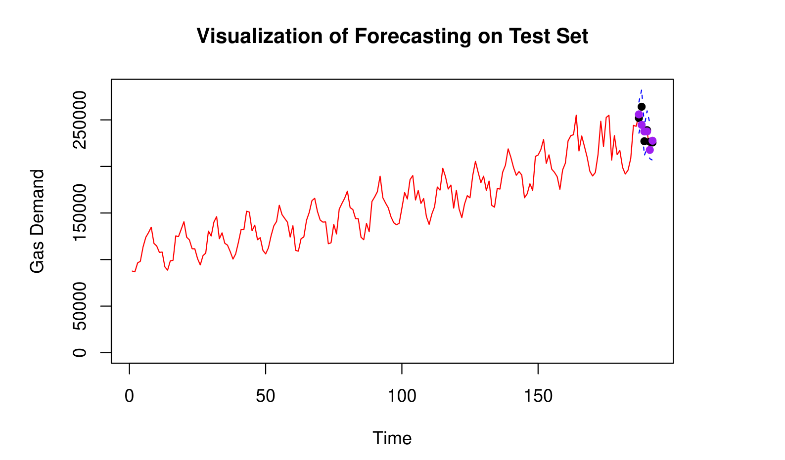
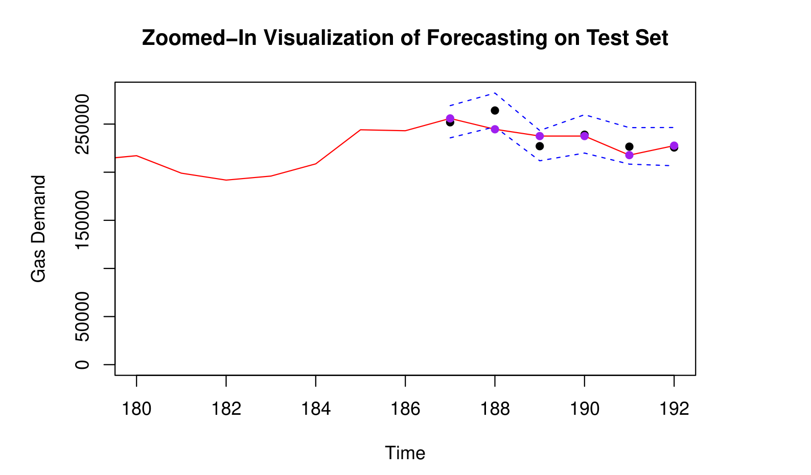

*Black points = model predictions · Purple points = actual observed values*

From the zoomed-in plot, one actual observed value (purple) falls slightly outside the calculated prediction interval. This kind of deviation can happen for reasons outside the historical training data — one plausible explanation is the lingering economic effects of the 1973 Oil Crisis (fuel rationing, price controls) persisting into the forecast period. Given the historical volatility of energy markets, a single point falling outside the interval is a reasonably expected outcome rather than a sign of model failure.

---

## Conclusion

The primary goals of this project were to analyze long-term patterns in gasoline demand in Ontario between January 1960 and June 1975, fit a reliable time series model for forecasting, and evaluate its predictive accuracy over the final six months (July – December 1975). These goals were sufficiently achieved. The final selected model, **SARIMA(2, 1, 0)(0, 1, 1)[12]**, performed well in capturing the underlying trend and seasonal components of the data, producing prediction intervals that ultimately contained **five out of six** actual observed values in the test set.

Despite a minor residual autocorrelation issue and persistent spikes at lag 23 in the residual ACF and PACF, the best fitted model passed all major diagnostic checks for the ACF, including the Shapiro-Wilk, Box-Pierce, Ljung-Box, and McLeod-Li tests. The issues related to the AR(0) condition and lag 23 behavior were further investigated through alternate models, but due to a lack of identifiable seasonal structure, they were considered non-problematic.

**Final model:**

(1 + 0.9827B + 0.6875B²)(1 − B)(1 − B¹²)Xₜ = (1 + 0.5870B¹²)Zₜ

where Xₜ = log(Uₜ), B is the backshift operator, and Zₜ represents white noise.

All computations and analyses were carried out in R, using packages such as `forecast`, `tsdl`, and functions from the `stats` package.

*Thanks to Professor Feldman for guidance throughout this course and project, a classmate for help finding this dataset, and teaching assistant Lihao Xiao for clarifying aspects of the residual diagnostic analysis.*

## References

- R Core Team. (2024). *R: A Language and Environment for Statistical Computing* (Version 2024.09.0+375) [Computer software]. R Foundation for Statistical Computing.
- Koivu, J. (2024). *tsdl: Time Series Data Library* (Version 0.1.0) [R package].
- Hyndman, R.J., and Khandakar, Y. (2024). *forecast: Forecasting functions for time series and linear models* (Version 8.22.0) [R package].

---

## Appendix: Full Code

<details>
<summary>Click to expand full R script</summary>

```r
# Load required packages
library(tsdl)     # Access the Time Series Data Library
library(forecast)  # For predict()

# Import the dataset "Monthly gasoline demand Ontario gallon millions 1960 - 1975"
# 12 is the domain; 'Sales' is the category; [[1]] represents position in the list
gas <- subset(tsdl, 12, "Sales")[[1]]
attr(gas, "description")

# Split data into training (first 186 months) and test (last 6 months)
train_gas <- gas[1:186]  # January 1960 to June 1975
test_gas <- gas[187:192] # July 1975 to December 1975

# Plot training data, with trend and mean lines
plot.ts(as.numeric(train_gas),
        main = "Original Time Series of Training Data",
        ylab = "Gas Demand")
ntr = length(as.numeric(train_gas))
fit_train <- lm(as.numeric(train_gas) ~ as.numeric(1:ntr))
abline(fit_train, col = "red")
abline(h = mean(as.numeric(train_gas)), col = "blue")

# Stabilize variance by Box-Cox log transformation
gas.log = log(train_gas)
par(mfrow = c(1,2))
hist(train_gas, col = "purple", xlab = "", main = "Histogram of Training Data")
hist(gas.log, col = "blue", xlab = "", main = "Histogram of Log-Transformed Data", breaks = 10)

# Plot log-transformed data with trend and mean lines
gas.log_raw = as.numeric(gas.log)
plot.ts(gas.log_raw, main = "Log(Gas) Demand", ylab = "Log(Gas)")
nt = length(gas.log_raw)
fit <- lm(gas.log_raw ~ as.numeric(1:nt))
abline(fit, col = "red")
abline(h = mean(gas.log_raw), col = "blue")

# Plot ACF and PACF of log-transformed data
acf(gas.log, lag.max = 40, main = "")
title("ACF of Log(Gas)")
pacf(gas.log, lag.max = 40, main = "")
title("PACF of Log(Gas)")

# Remove trend component by differencing log-transformed data at lag 1
gas.lag_1 <- diff(gas.log, lag = 1)
plot.ts(gas.lag_1, main = "Log(Gas), Differenced at Lag 1", ylab = "Log(Gas)")
fit_1 <- lm(gas.lag_1 ~ as.numeric(1:length(gas.lag_1)))
abline(fit_1, col = "red")
abline(h = mean(gas.lag_1), col = "blue")

# Compare variance before and after differencing at lag 1
var_log <- var(gas.log)
var_diff_1 <- var(gas.lag_1)

acf(gas.lag_1, lag.max = 40, main = "")
title("ACF of Log(Gas), Differenced at Lag 1")

# Remove seasonal component by also differencing at lag 12
gas.lag_1_12 <- diff(gas.lag_1, lag = 12)
plot.ts(gas.lag_1_12, main = "Log(Gas), Differenced at Lag 1 and 12", ylab = "Log(Gas)")
fit_1_12 <- lm(gas.lag_1_12 ~ as.numeric(1:length(gas.lag_1_12)))
abline(fit_1_12, col = "red")
abline(h = mean(gas.lag_1_12), col = "blue")

var_diff_1 <- var(gas.lag_1)
var_diff_12 <- var(gas.lag_1_12)

acf(gas.lag_1_12, lag.max = 40, main = "")
title("ACF of Log(Gas), Differenced at Lag 1 and 12")
pacf(gas.lag_1_12, lag.max = 40, main = "")
title("PACF of Log(Gas), Differenced at Lag 1 and 12")

# Custom AICc() function (qpcR::AICc was unavailable)
# AICc = AIC + (2k * (k + 1)) / (n - k - 1), where AIC = -2*logLik + 2k
AICc <- function(model) {
  loglik <- as.numeric(logLik(model))
  k <- attr(logLik(model), "df")
  n <- length(residuals(model))
  aic <- -2 * loglik + 2 * k
  aicc <- aic + (2 * k * (k + 1)) / (n - k - 1)
  return(aicc)
}

# Grid search over ARMA(p,q) via maximum likelihood estimation
aiccs <- matrix(NA, nr = 6, nc = 6)
dimnames(aiccs) = list(p = 0:5, q = 0:5)
for(p in 0:5) {
  for(q in 0:5) {
    aiccs[p + 1, q + 1] = AICc(arima(gas.log, order = c(p, 1, q), method = "ML"))
  }
}
aiccs
(aiccs == min(aiccs))

# Fit candidate SARIMA models; examine coefficients for 95% CI significance
model1 <- arima(gas.log, order = c(1, 1, 0),
                 seasonal = list(order = c(0, 1, 3), period = 12), method = "ML")
model1

model2 <- arima(gas.log, order = c(1, 1, 0),
                 seasonal = list(order = c(0, 1, 2), period = 12), method = "ML")
model2

model3 <- arima(gas.log, order = c(1, 1, 1),
                 seasonal = list(order = c(0, 1, 2), period = 12), method = "ML")
model3

model4 <- arima(gas.log, order = c(2, 1, 1),
                 seasonal = list(order = c(0, 1, 2), period = 12), method = "ML")
model4

model5 <- arima(gas.log, order = c(2, 1, 0),
                 seasonal = list(order = c(0, 1, 1), period = 12), method = "ML")
model5  # Model 4, but without ma1 and sma2

# Compare AICc for each model
AICc1 <- AICc(model1); AICc1
AICc2 <- AICc(model2); AICc2
AICc3 <- AICc(model3); AICc3
AICc4 <- AICc(model4); AICc4
AICc5 <- AICc(model5); AICc5  # Lowest AICc

# Check stationarity of model 5 (invertibility required no extra computation)
polyroot(c(1, 0.9827, 0.6875))

# Diagnostic plots for model 5
res5 = residuals(model5)
par(mfrow = c(2,2))
hist(res5, density = 20, breaks = 20, col = "blue", xlab = "", prob = TRUE,
     main = "Histogram of Residuals of Model 5")
m5 <- mean(res5)
std5 <- sqrt(var(res5))
curve(dnorm(x, m5, std5), add = TRUE)
plot.ts(res5, ylab = "Residuals of Model 5", main = "Residuals Plot of Model 5")
fitt5 <- lm(res5 ~ as.numeric(1:length(res5)))
abline(fitt5, col = "red")
abline(h = mean(res5), col = "blue")
qqnorm(res5, main = "Normal Q-Q Plot for Model 5")
qqline(res5, col = "blue")

# Portmanteau statistic tests for model 5
shapiro.test(res5)
Box.test(res5, type = c("Box-Pierce"), lag = 13, fitdf = 3)
Box.test(res5, type = c("Ljung-Box"), lag = 13, fitdf = 3)
Box.test((res5)^2, type = c("Ljung-Box"), lag = 13, fitdf = 0)

# Check if residuals meet AR(0) condition for model 5
ar(res5, aic = TRUE, order.max = NULL, method = c("yule-walker"))

# Plot ACF and PACF of model 5 residuals
acf(res5, lag.max = 40, main = "")
title("ACF of the Residuals of Model 5")
pacf(res5, lag.max = 40, main = "")
title("PACF of the Residuals of Best Model 5")

# Re-establish the best model (model 5)
bestmodel <- arima(gas.log, order = c(2, 1, 0),
                    seasonal = list(order = c(0, 1, 1), period = 12), method = "ML")
bestmodel

# Forecast six months ahead on the log scale
library(forecast)
pred.log <- predict(bestmodel, n.ahead = 6)
U.tr = pred.log$pred + 2 * pred.log$se
L.tr = pred.log$pred - 2 * pred.log$se

ts.plot(gas.log, xlim = c(1, length(gas.log) + 6), ylim = c(min(gas.log), max(U.tr)))
lines(U.tr, col = "blue", lty = "dashed")
lines(L.tr, col = "blue", lty = "dashed")
points((length(gas.log) + 1):(length(gas.log) + 6), pred.log$pred, col = "black", pch = 16)

ts.plot(gas.log, xlim = c(150, length(gas.log) + 6), ylim = c(12, max(U.tr)))
lines(U.tr, col = "blue", lty = "dashed")
lines(L.tr, col = "blue", lty = "dashed")
points((length(gas.log) + 1):(length(gas.log) + 6), pred.log$pred, col = "black", pch = 16)

# Fit the best model on the test set (convert back to original scale)
pred.log <- predict(bestmodel, n.ahead = 6)
m.log <- pred.log$pred
se.log <- pred.log$se
U.log = m.log + (2 * se.log)
L.log = m.log - (2 * se.log)
pred.orig <- exp(m.log)
U <- exp(U.log)
L <- exp(L.log)

index <- (length(train_gas) + 1):(length(train_gas) + length(test_gas))

ts.plot(as.numeric(gas), ylim = c(0, max(U)), col = "red",
        ylab = "Gas Demand", main = "Visualization of Forecasting on Test Set")
lines(index, U, col = "blue", lty = "dashed")
lines(index, L, col = "blue", lty = "dashed")
points(index, pred.orig, col = "black", pch = 16)
points(index, test_gas, col = "purple", pch = 16)

# Zoomed-in comparison: black = predicted, purple = actual
ts.plot(as.numeric(gas), xlim = c(180, length(train_gas) + 6), ylim = c(200, max(U)),
        col = "red", ylab = "Gas Demand", main = "Zoomed-In Visualization of Forecasting on Test Set")
lines(index, U, col = "blue", lty = "dashed")
lines(index, L, col = "blue", lty = "dashed")
points(index, pred.orig, col = "black", pch = 16)
points(index, test_gas, col = "purple", pch = 16)
```

</details>
